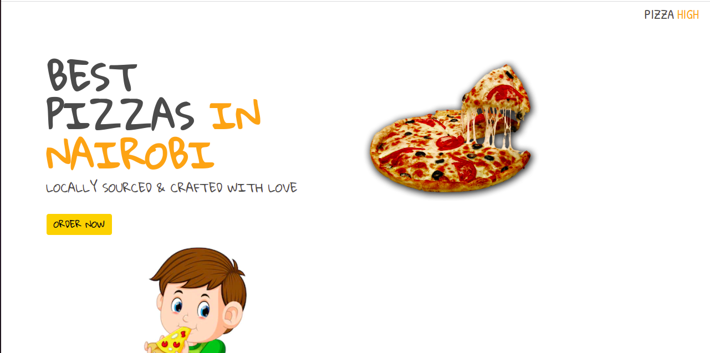
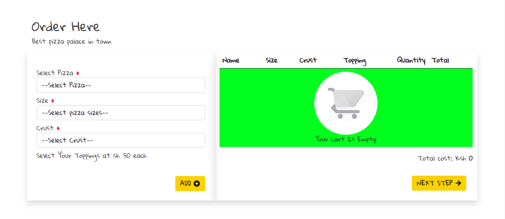
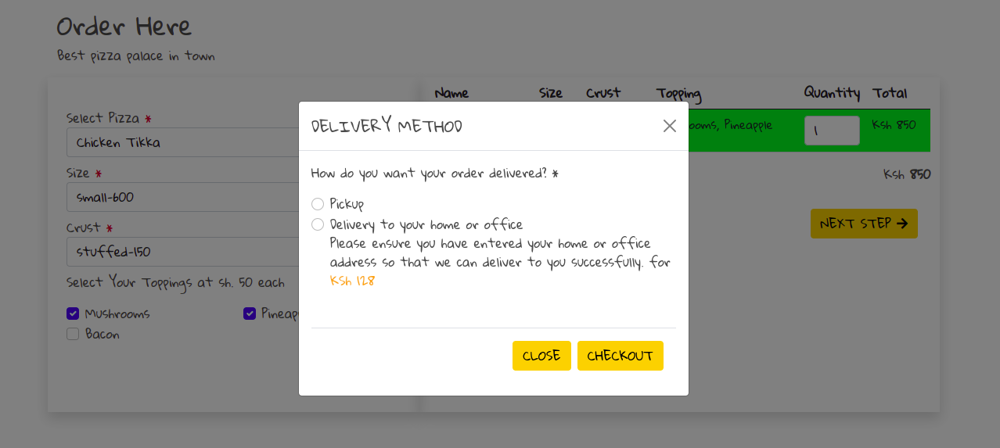
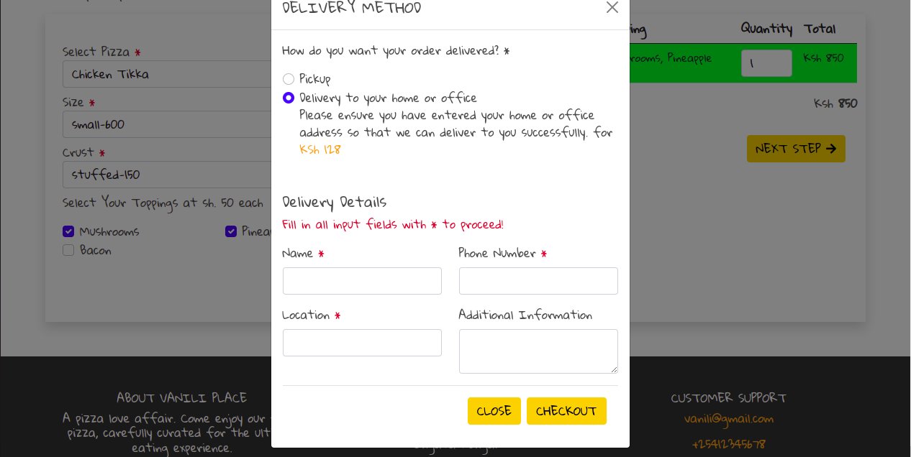
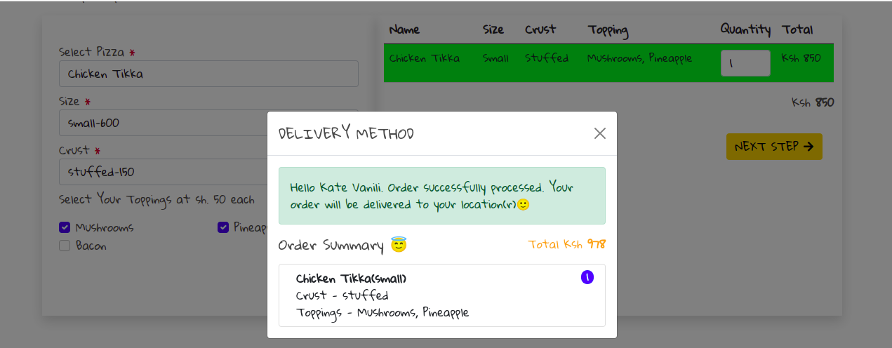

# About This Pizza Ordering site

This project is based on [Javascript CSS HTML](#TechStack).

The website features a system that will allow the user to pick the kind of pizza, crust and toppings they wish to get, order whatever amount of pizzas they want, have an option to have their pizza deliveed at a fee, and proceed to payment. Its a web application that has been designed to be easy to navigate and use by all people.

## Author
Kate Vanili

# Table of Content

-   [Prerequisites](#Prerequisites)
-   [Setup Environment](#Technologies)
-   [Application features](#features)
-   [Contribute]

## Prerequisites

---

Make sure you have a browser with javascript enabled.

## Technologies

---
-   Javascript
-   CSS
-   HTML

### Setup Environment

1. Clone the repo : `git clone https://github.com/VaniliKate/week-four-IP.git`
2. Locate `index.html` from the file
3. Run `index.html` file in your favorite browser

## Application features

---
-   Select pizza flavour.
-   Select pizza crust.
-   Select pizza toppings.
-   Input location details.
-   Proceed to checkout.

Live site link:
https://vanilikate.github.io/week-four-IP/

